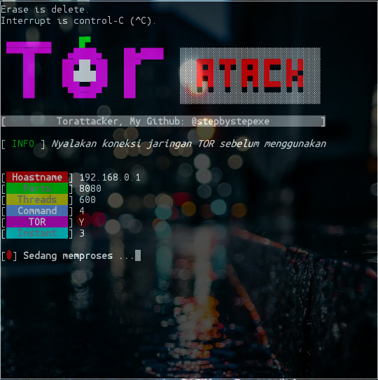

# Torattacker:
**```Tor```** adalah server yang membuat pengguna menjadi anonim dalam internet.
**```Attack```** adalah jenis serangan terhadap sebuah komputer atau server di dalam jaringan internet dengan cara menghabiskan sumber (resource) yang dimiliki oleh komputer tersebut.
#### Screenshot:

#### Informasi:
```
Nama        : Torattacker
Versi       : 4.5 (Update: 23 Februari 2020, 9:30 AM)
Tanggal     : 12 Agustus 2019
Author      : Nedi Senja
Tujuan      : Ddos nenggunakan jaringan TOR
              atau jaringan bawang
Terimakasih : Allah SWT.
              FR13NDS, & seluruh
              manusia seplanet bumi
NB          : Manusia gax ada yang sempurna
              sama kaya tool ini.
              Silahkan laporkan kritik atau saran
              Ke - Email: d_q16x@outlook.co.id
                 - WhatsApp: https://tinyurl.com/wel4alo

[ Gunakan tool ini dengan bijak ]
```
#### Fitur:
+ tor.project
#### Cara Menginstall:
```
git clone https://github.com/stepbystepexe/Torattacker
cd Torattacker
ls
bash torattacker.sh
```
#### Kontak:
+ Email d_q16x@outlook.co.id
+ WhatsApp https://tinyurl.com/wel4alo
#### Paypal:
+ Onclick https://bit.ly/3dcEQcN
#### LiberaPay:
<noscript><a href="https://liberapay.com/stepbystepexe/donate"></a></noscript>
>**Created by Nedi Senja**
